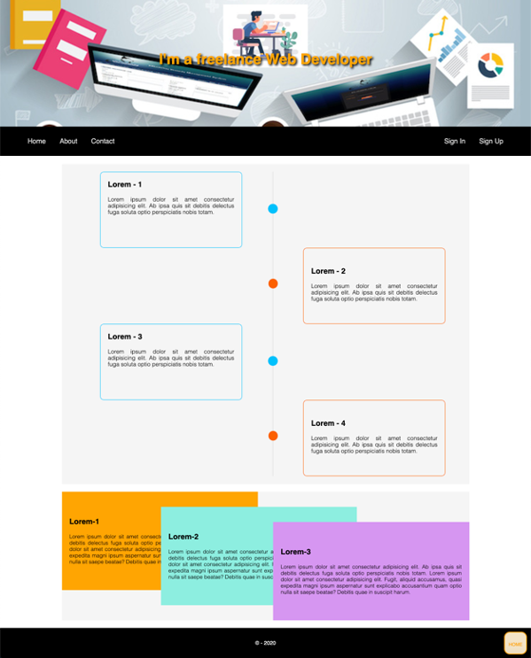

# UIB_Layout_Position_Exercise-1

Single webpage about CSS Position property

## Instructions

- Add a title to the document
- Use External CSS to style the document
- Please just code what you see, neither less nor more.
- Try to use CSS position property with proper values in this exercise sections.

## The desktop overview

## The online version

In order to see live version, just [click...!](https://hsnakk.github.io/UIB_Layout_Position_Exercise-1/)
